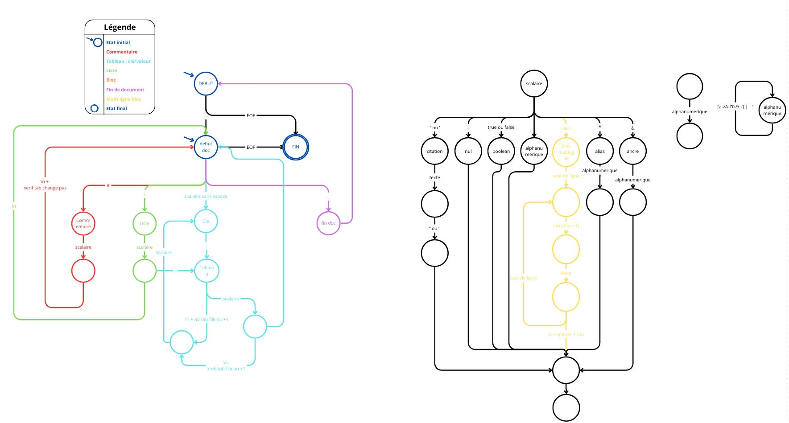

# YAML PARSER
*Réalisé par : Isalyne LLINARES--RAMES DO4 2024*
# Objectif 

- Ecrire la grammaire du langage YAML
- Construire l'automate correspondant à cette grammaire  
- Coder un parseur auquel on donnera des phrases et il pourra reconnaitre si les mots appartiennent au langage YAML

## Définition de la grammaire 

Le YAML peut être décrit par ces notations :
- des documents séparés par trois tirets (---), trois points (...) optionnels pour marquer la fin d'un document
- des éléments : 
    - des commentaires (# scalaire)
    - des éléments de listes (- scalaire ) (1 par ligne)
    - des tableaux (key: value ou bloc ) (1 par ligne)
- des blocs qui sont commencés par des sauts de ligne et d'une indentation
- des scalaires:
    - entourés de guillemets doubles ou simples ("value" ou 'value') 
    - des valeurs nulles (~)
    - des booléens (true, false)
    - des suites de caractères alphanumériques ([a-zA-Z0-9_ ])
    - des blocs multilignes (| ou >)
    - des noeuds répétés (&value)(ancre) et référencés (*value)(alias)

 *Source :* [ https://fr.wikipedia.org/wiki/YAML](https://fr.wikipedia.org/wiki/YAML)

Pour définir une grammaire, on utilise la notation Backus-Naur Form aussi appelée BNF. Elle permet de décrire les langages de programmation.
```
<document> ::= "---" <élément>* ("..." | "")

<element> ::= <commentaire> | <liste> | <tableau> | <bloc>
<commentaire> ::= "#" <scalaire>
<liste> ::= "-" <scalaire>
<tableau> ::= <clé> ":" <scalaire>
<bloc> ::= <saut de ligne> <indentation> <element>+

<clé> ::= <scalaire>

<scalaire> ::= <citation> | <valeur nulle> | <booléen> | <alphanumerique> | <bloc multilignes> | <alias> | <ancre>
<citation> ::= '"' <texte> '"' | "'" <texte> "'"
<valeur nulle> ::= "~"
<booléen> ::= "true" | "false"
<alias> ::= "*" <alphanumerique>
<ancre> ::= "&" <alphanumerique>
<alphanumerique> ::= <caractère>+
<texte> ::= <caractère>*
<caractère> ::= [a-zA-Z0-9_-] | " "

<bloc multilignes> ::= "|" <saut de ligne> <bloc de ligne> | ">" <saut de ligne> <bloc de ligne>  

<bloc de ligne> ::= (<indentation> <texte> <saut de ligne>)*

<saut de ligne> ::= "\n"
<indentation> ::= "  "
```
## Automate correspondant à la grammaire

On utilise un automate à pile afin de vérifier l'indentation qui est importante dans le langage YAML.
L'indentation se fait principalement après avoir rencontré un tableau ou une liste. On vérifie donc que les éléments suivants sont bien indentés.


## Parseur

Ce parseur permet de vérifier si un fichier est conforme à la grammaire YAML. Il est codé en Python.
Pour cela, on parcourt le fichier caractère par caractère et selon l'état actuel, l'état passé et l'indentation, on détermine si le caractère est conforme à la grammaire. Si ce n'est pas le cas, on génère une erreur sinon on continue jusqu'à la fin du fichier.

### Exemple d'utilisation

**Prérequis :** Avoir Python installé sur votre machine

- Cloner le repository 
- Ajouter dans le dossier le fichier à tester ou choisir un fichier existant
- Dans le fichier parseurtest.py, modifier le nom du fichier à tester (ligne 303)
- Puis lancer le fichier parseurtest.py grâce à la commande `python parseur.py`

> [!CAUTION]  
> On considère qu'une indentation correspond à 2 espaces  

> [!TIP]  
> Les fichiers file1 à 3 sont des exemples de fichiers conformes à la grammaire YAML, tandis que les fichiers file4 à 6 ne le sont pas.